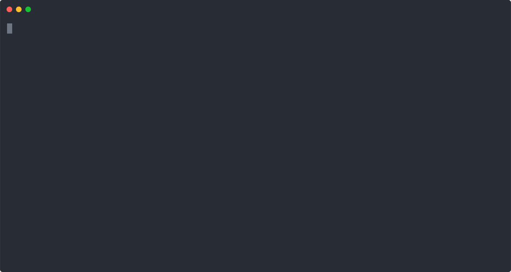
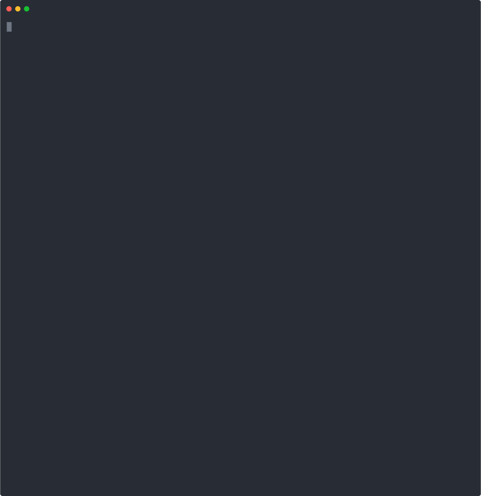
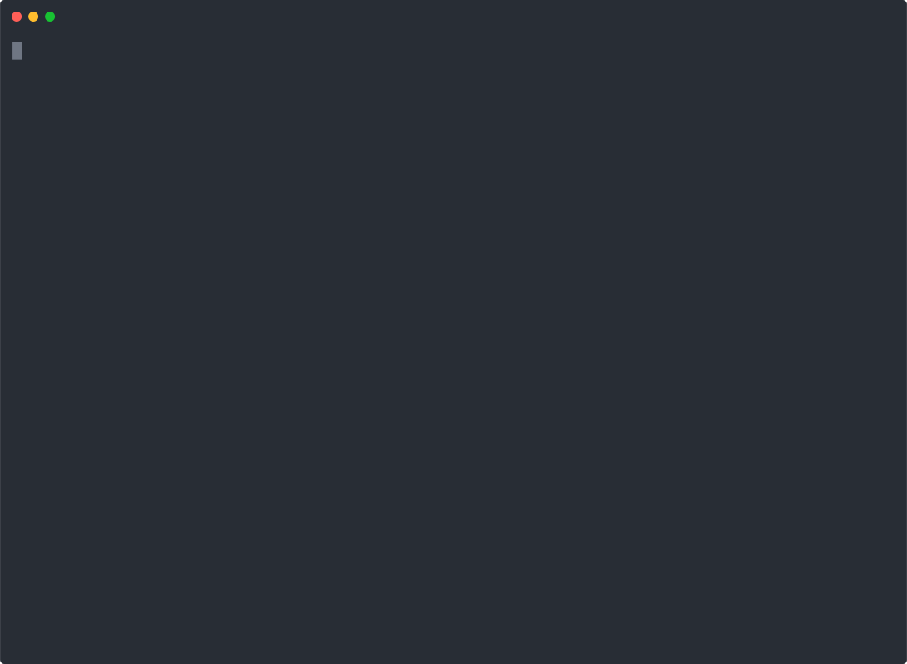

# Hexlet frontend project II

## Difference generator
[](https://asciinema.org/a/297180)
### CLI app, which compares two configuration files and shows a difference.

[](https://codeclimate.com/github/it-amalker/frontend-project-lvl2/maintainability)
[](https://codeclimate.com/github/it-amalker/frontend-project-lvl2/test_coverage)

[](https://travis-ci.org/it-amalker/frontend-project-lvl2)

### Install packages
* [Clone](https://help.github.com/en/github/using-git/which-remote-url-should-i-use#cloning-with-https-urls-recommended) [this](https://github.com/it-amalker/frontend-project-lvl2.git) repository
* Install [Node Version Manager (NVM)](https://github.com/nvm-sh/nvm#install--update-script)
* Install [Node.js](https://github.com/nvm-sh/nvm#usage) with nvm:
```
$ nvm install node
```
* Run these commands from cloned gendiff directory:
```
$ make install
$ make publish
```
[](https://asciinema.org/a/297173)
### How to start app:
#### Supported file formats: JSON, YAML, INI
#### Supported output: default, plain, json
```
$ gendiff --format [output type] <pathToFile1> <pathToFile2>
```
#### Comparing two JSON files
[](https://asciinema.org/a/295379)

#### Comparing two YAML files
[](https://asciinema.org/a/295536)

#### Comparing two INI files
[](https://asciinema.org/a/295619)

#### Comparing two files recursively with default output
[](https://asciinema.org/a/296088)

#### Comparing two files recursively with plain output
[](https://asciinema.org/a/296231)

#### Comparing two files recursively with json output
[](https://asciinema.org/a/296604)
